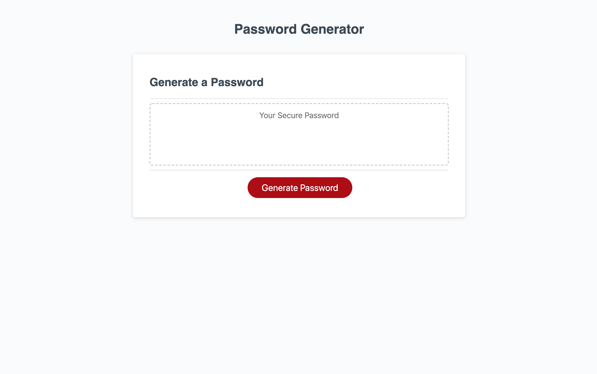
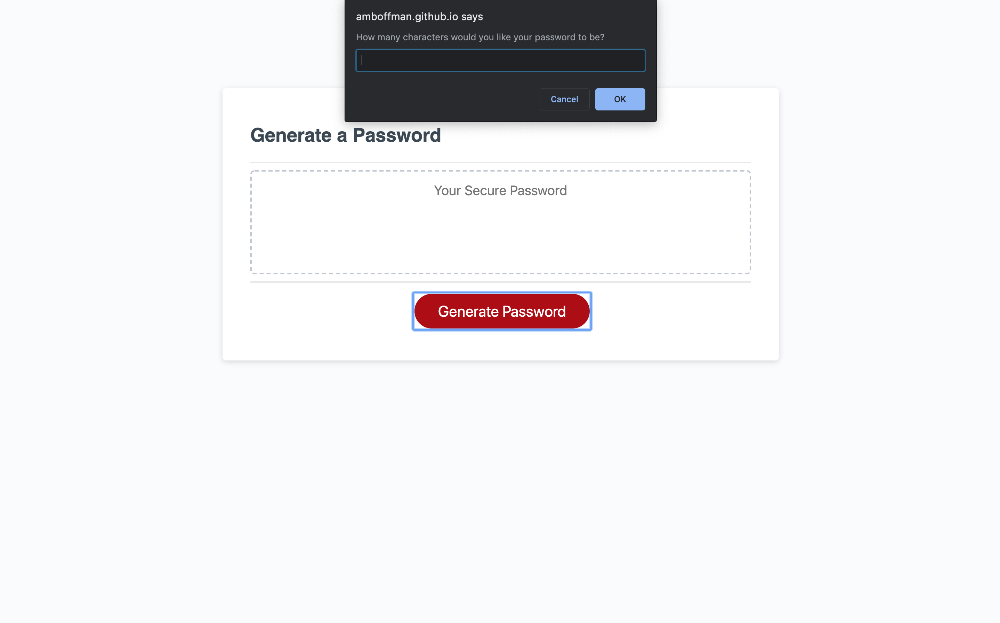
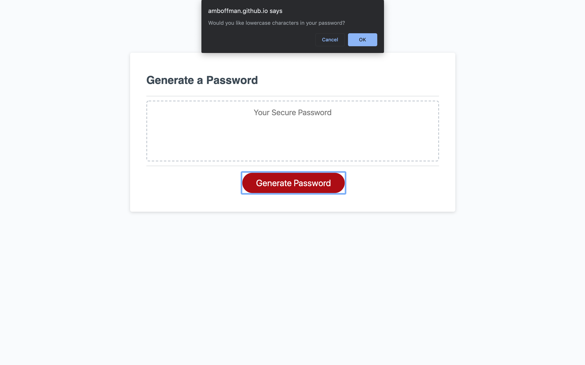

# Password Generator

This application wil generate a random password based on your desired criteria.

## Deployed Link
[Deployed Link](https://amboffman.github.io/password-generator/)

## Github Repository
[Github Repository](https://github.com/amboffman/password-generator)

## How to Use

In this program, you'll be able to generate a secure, randomly generated, password.

When you hit "Generate Password" you'll be asked how long you'd like your password to be. Please enter a password legnth between 8 and 128 characters. If it does not fall between these numbers, you'll be alerted.

You will then be asked what type of characters you'd like to include in your password. Hit OK to include and cancel to omit.

The generator will create your password for you to copy and use at your leisure.

Feel like making a different password? Just his "Generate Password" again.